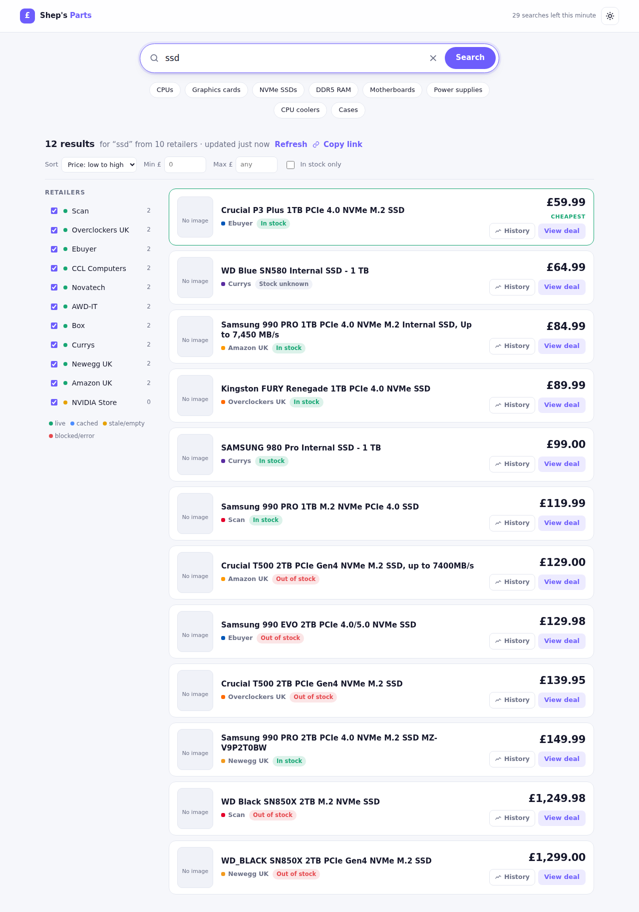

# Shep's Parts

Search UK PC component retailers in one place and see who has the part cheapest.
Type "rtx 5070", "2tb nvme" or "ryzen 7 9800x3d", get one sorted price list back,
with the retailer, stock status and a link straight to the product.



## Retailers

| id | Retailer | Notes |
|----|----------|-------|
| `scan` | [Scan](https://www.scan.co.uk) | Imperva bot protection; may show as *blocked* from datacentre IPs |
| `overclockers` | [Overclockers UK](https://www.overclockers.co.uk) | |
| `ebuyer` | [Ebuyer](https://www.ebuyer.com) | |
| `ccl` | [CCL Computers](https://www.cclonline.com) | |
| `novatech` | [Novatech](https://www.novatech.co.uk) | |
| `awd_it` | [AWD-IT](https://www.awd-it.co.uk) | Magento storefront |
| `box` | [Box](https://www.box.co.uk) | |
| `currys` | [Currys](https://www.currys.co.uk) | Akamai bot manager; often blocks non-browser clients |
| `newegg` | [Newegg UK](https://www.newegg.com/global/uk-en/) | GBP storefront; includes marketplace sellers |
| `nvidia` | [NVIDIA Store](https://marketplace.nvidia.com/en-gb/consumer/graphics-cards/) | NVIDIA's UK marketplace feed: partner retailers' price and stock for every GeForce card, shown as "sold by Scan / Overclockers UK / AWD-IT…". Graphics cards only |
| `amazon` | [Amazon UK](https://www.amazon.co.uk) | Blocks most non-browser traffic, near-certain from cloud IPs. Works best from a home connection; the supported route is Amazon's Product Advertising API |

Argos is left out: results render client-side behind bot protection, so it would
only ever show as "blocked". To drop any retailer set `ENABLED_RETAILERS`, e.g.
`ENABLED_RETAILERS=scan,overclockers,ebuyer,ccl,novatech,awd_it,box,newegg`.

## Quick start

```bash
cd pc-parts-scraper
python -m venv .venv && source .venv/bin/activate   # Windows: .venv\Scripts\activate
pip install -r requirements.txt
python -m app
```

Open <http://localhost:8000>. API docs are at `/api/docs`.

Or with Docker:

```bash
docker compose up --build
```

## Affiliate product feeds (recommended)

Scraping is the fallback, not the goal. If you are approved on an affiliate network,
import its product feed instead: one scheduled download replaces every live request,
searches answer from local SQLite in milliseconds, nothing can block you, and you get
the whole catalogue plus EAN/MPN codes, stock and delivery cost.

**A feed-backed retailer automatically replaces its scraper.** Anything not in a feed
keeps being scraped, so you can migrate one shop at a time.

### Setting it up

1. In Awin, go to **Toolbox → Create-a-Feed**.
   * **Advertisers**: select only the shops you actually want. Awin will happily hand
     you every programme you have joined; a feed with 150 advertisers and every category
     ticked runs to millions of rows of clothing and homeware.
   * **Brand**: leave empty. Filtering by brand silently drops every other manufacturer.
   * **Format**: CSV, gzip compression, adult content off.
   * **Columns**: `aw_deep_link`, `product_name`, `merchant_product_id`, `merchant_name`,
     `merchant_category`, `search_price`, `currency`, `merchant_image_url`,
     `delivery_cost`, and — important — `in_stock`, `stock_quantity`, `brand_name`,
     `mpn`, `ean`. Without `in_stock` every listing shows "Stock unknown"; without
     `brand_name`/`mpn`/`ean` the same product cannot be matched across shops later.
     The importer warns you at import time if any of these are absent.

   Copy the generated URL. It contains your API key, so treat it as a password.
2. `cp feeds.example.json feeds.json`, paste the URL in, and check `retailer_map` uses
   the merchant names exactly as they appear in your Awin account. `feeds.json` is
   git-ignored because the URL contains your API key.
3. Import:

```bash
python -m scripts.import_feeds --dry-run   # parse and report, write nothing
python -m scripts.import_feeds             # for real
python -m scripts.import_feeds --list      # what is loaded, and when
```

```
awin: imported 48211 products, skipped 1350 (22.4s)
    scan                   14022
    ebuyer                 11890
    overclockers            9455
```

Then schedule it daily (`deploy/README.md` has a cron line). The running app notices a
new import within a minute; no restart needed.

### Feed settings

Each entry in `feeds.json` accepts:

| Key | Meaning |
|-----|---------|
| `id` | Name for this feed. Re-importing replaces everything from the same id |
| `url` / `path` | Download it, or read a local file (testing) |
| `profile` | `auto` (default), `awin` or `google`. Auto-detects from the header row |
| `retailer_map` | Merchant name → retailer id, so feed rows take over from that scraper |
| `retailer_name` | Fixed shop name for a single-merchant feed with no merchant column |
| `include_pattern` / `exclude_pattern` | Regex on title + category to keep or drop rows |
| `currency` | Rows in other currencies are skipped (default `GBP`) |
| `max_rows`, `delimiter`, `encoding` | Escape hatches for awkward feeds |

Gzip and zip are handled automatically, and feeds are streamed to a temp file and
inserted in batches, so memory stays flat no matter how large the file is (a 400k-row
feed imports in about 8 seconds using ~70 MB). If the importer cannot find a column it
needs, it says so and lists the columns the feed actually has.

### Amazon and Newegg

Not on Awin. Amazon needs its own Product Advertising API (Associates account plus
three qualifying sales), Newegg runs through Impact. Both keep scraping in the meantime.

## Check the scrapers against the live sites

Retail sites change their markup without warning, so before relying on it run the
probe. It queries every retailer once and tells you which extraction tier each one
resolved through:

```bash
python -m scripts.probe "rtx 4070"
python -m scripts.probe "1tb nvme" --retailers scan,ebuyer --dump data/dumps -v
```

```
retailer      status    items   secs  tier / message
------------------------------------------------------------------------------
scan          ok           24    1.3  css:li.product[data-price]
overclockers  ok           30    0.9  css:.product-box
ebuyer        ok           18    1.1  jsonld
currys        blocked       0    0.4  www.currys.co.uk returned 403 (bot protection?)
```

* `css:*` means the site-specific selectors matched (best quality).
* `jsonld` / `microdata` means the selectors did not match but the shop embeds
  schema.org data, which is used instead.
* `heuristic` means results came from the generic "find a price, walk up to the
  product card" fallback. Usually fine, but worth tightening the selectors.
* `empty` with `--dump` lets you open the saved HTML and update the selectors in
  `app/scrapers/retailers.py`.

## How it works

```
browser ──> FastAPI (/api/search) ──> SearchService
                                        ├─ per-retailer cache (SQLite, TTL)
                                        ├─ single-flight: identical concurrent searches share one fetch
                                        └─ asyncio fan-out ──> Fetcher (httpx, HTTP/2)
                                                                ├─ global concurrency cap
                                                                ├─ per-host concurrency + minimum interval
                                                                ├─ retries with backoff
                                                                └─ bot-challenge detection
                                              each retailer ──> tiered parser (css → json-ld → microdata → heuristic)
```

* **Fast**: all retailers are queried concurrently; a slow or blocked shop cannot hold
  up the others. Results parse with `selectolax` (C-backed) and the whole response is gzip'd.
* **Up to date**: results are cached per retailer for `CACHE_TTL_SECONDS` (15 minutes
  by default). The Refresh button forces a live fetch, rate-limited to once a minute
  per query. When a refresh fails the last good results are shown and marked *stale*.
* **Limits**: outbound requests are throttled per host so no retailer sees a burst,
  inbound searches are limited per client IP (`429` with `Retry-After`), query length
  and per-retailer result counts are capped.
* **Price history**: every fresh fetch records price observations. A listing shows
  "▼ £20 was £539.99" when a price has moved since it was last seen and "lowest seen
  £499" when it has been cheaper before. The History button on each row opens a chart
  of every recorded price with current / lowest / highest and a table view.
* **Always warm**: a background loop re-runs the most popular searches (plus the
  category shortcuts) just before their cache expires, so common queries are answered
  instantly from cache and price history builds up even when nobody is searching.
  Tune with `WARM_*` settings; set `WARM_TOP_QUERIES=0` and `WARM_CATEGORIES=false`
  to disable.
* **Copy link**: every search has a shareable URL (query, retailer filter and sort),
  and the page carries Open Graph tags so links preview cleanly in Discord.

## Configuration

Copy `.env.example` to `.env`. Everything is optional.

| Variable | Default | Meaning |
|----------|---------|---------|
| `CACHE_TTL_SECONDS` | `900` | How long results count as fresh |
| `RETAILER_TIMEOUT_SECONDS` | `12` | Per-retailer request timeout |
| `GLOBAL_MAX_CONCURRENCY` | `16` | Max in-flight outbound requests |
| `PER_HOST_MAX_CONCURRENCY` | `2` | Max in-flight requests to one retailer |
| `PER_HOST_MIN_INTERVAL_SECONDS` | `1.0` | Minimum spacing between requests to one retailer |
| `MAX_RESULTS_PER_RETAILER` | `40` | Cap per retailer per query |
| `API_RATE_LIMIT_PER_MINUTE` | `30` | Searches allowed per client IP per minute |
| `GLOBAL_SEARCH_LIMIT_PER_MINUTE` | `300` | Searches allowed per minute across all clients |
| `FORCE_REFRESH_MIN_INTERVAL_SECONDS` | `60` | Minimum gap between forced refreshes of one query |
| `MAX_QUERY_LENGTH` | `80` | Longest accepted search |
| `WARM_TOP_QUERIES` | `20` | Popular searches (last 7 days) kept warm in the background; `0` disables |
| `WARM_MIN_HITS` | `2` | A search must have been run this many times to be kept warm |
| `WARM_CATEGORIES` | `true` | Also keep the category shortcut searches warm |
| `WARM_INTERVAL_SECONDS` | `60` | How often the warmer checks what is due |
| `ENABLED_RETAILERS` | `all` | Comma-separated retailer ids to enable |
| `DEBUG_DUMP_DIR` | | Save every fetched page here (debugging) |

## API

* `GET /api/search?q=rtx+4070&retailers=scan,ebuyer&refresh=1`
* `GET /api/retailers` → each shop with `source: "feed"` or `"scrape"`
* `GET /api/categories`
* `GET /api/history?retailer=scan&url=...` → observations (oldest first), current, lowest, highest, first_seen
* `GET /api/health`

## Adding a retailer

Add a `Retailer(...)` to `app/scrapers/retailers.py` with the search URL template and
one or more `Strategy` blocks describing the product card (`item` selector, then
selectors for title, url, price, image and stock). Selectors accept `css@attr` to read
an attribute, and `self@attr` to read the card element itself. Append it to `RETAILERS`,
drop a saved search page into `tests/fixtures/<id>.html`, and add it to `EXPECTED` in
`tests/test_scrapers.py`.

## Tests

```bash
pip install -r requirements-dev.txt
pytest
```

The suite runs entirely offline against saved HTML in `tests/fixtures/`.

## Hosting it publicly

For a VPS behind Cloudflare (no open ports, TLS handled at the edge) see
[`deploy/README.md`](deploy/README.md). It covers the tunnel, DNS and an edge rate
limit, by dashboard or Terraform.

* Put it behind a reverse proxy with HTTPS (Caddy, nginx, Cloudflare Tunnel). Start
  uvicorn with `--proxy-headers --forwarded-allow-ips <proxy ip>` so the per-client
  rate limit sees real visitor addresses. Never use `*` there: the app deliberately
  ignores `X-Forwarded-For` itself, because anyone can send that header.
* The app is effectively a proxy that fetches from retailers on visitors' behalf. The
  per-client and global search caps exist so a flood of requests cannot make your
  server hammer the shops and get its IP banned. Lower them if you see blocks.
* Responses carry a strict Content-Security-Policy, `X-Frame-Options: DENY` and
  `nosniff`. Product links are limited to http(s). All database access is parameterised.
* Old cached results (7 days), price observations (90 days) and query stats (30 days) are purged hourly.
* The warmer adds steady background traffic: roughly (warm queries × retailers) requests per cache TTL. With the defaults that is about 28 queries × 11 retailers every 15 minutes. Lower `WARM_TOP_QUERIES` or raise `CACHE_TTL_SECONDS` if a retailer starts blocking.

## Being a good citizen

The scraper identifies as a normal browser, respects per-host limits, caches
aggressively and never hammers a shop. Keep the limits sensible if you host it
publicly. Prices are shown for comparison only. Always confirm on the retailer's site.
